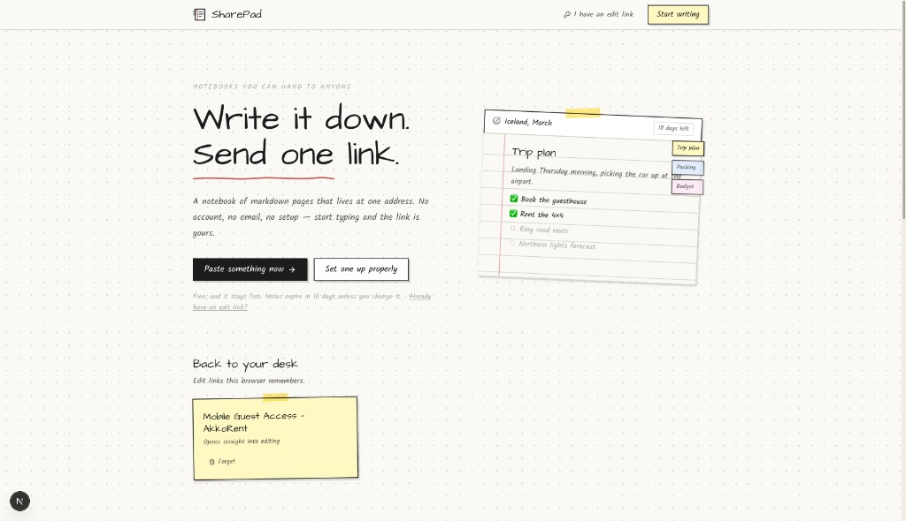

# SharePad

Write a notebook of markdown pages and share it with a single link. **No signup, no login.**



## What it does

- **Multi-page notebooks** behind one address, with a tabbed page index
- **Paste and share** — drop text in, get a link back, title and address chosen for you
- **Your own address** — `/n/kitchen-reno`, checked for availability as you type
- **Expiry** — 10 days by default, adjustable up to a year or off entirely
- **Two links** — a view link to hand out, a secret edit link you keep
- **Open editing** — optionally let anyone with the link write in it too
- **Password lock**, read-only mode, and burn-after-reading
- **Version history** — the last ten drafts of every page, restorable
- **Comments** from readers, no account required
- **PDF export** — the whole notebook as a clean document, no handwriting
- **Markdown export** and `.md` import
- **Paper and typeface** — ruled, grid, dotted or plain; handwritten, serif, sans or mono

## Running it

```bash
git clone https://github.com/Varshithvhegde/sharepad.git
cd sharepad
npm install

cp .env.example .env.local   # then fill in your Supabase keys

npm run dev
```

Apply the SQL in `supabase/migrations/` in order via the Supabase SQL editor, or
`supabase db push` if you have the CLI linked.

### Environment

```env
NEXT_PUBLIC_SUPABASE_URL=https://your-project.supabase.co
NEXT_PUBLIC_SUPABASE_ANON_KEY=your-publishable-key
SUPABASE_SERVICE_ROLE_KEY=your-service-role-key
NEXT_PUBLIC_SITE_URL=http://localhost:3000   # https://sharepad.in in production
```

`NEXT_PUBLIC_SITE_URL` feeds canonical URLs, the sitemap, `llms.txt` and the
links shown in the share panel, so it has to be the real origin once deployed.

## How expiry works

Choosing a lifetime stores an absolute timestamp, not a countdown. The moment it
passes, the view and print links return the 404 page.

A nightly `pg_cron` job then deletes the row for real, taking its pages, drafts
and comments with it through cascading foreign keys. It waits three days past
expiry before doing so: readers lose access immediately, but the owner keeps a
window to open the edit link and push the date back. Read-once notebooks are
removed a day after they are opened.

```sql
select cron.schedule(
  'purge-expired-notebooks', '15 3 * * *',
  $$select public.purge_expired_notebooks()$$
);
```

## How ownership works

There are no accounts. Creating a notebook mints a 32-byte edit token; only its
SHA-256 hash is stored. Whoever holds the token owns the notebook, and the browser
keeps a copy in `localStorage` so it shows up on the home page.

```
/n/{slug}        read it
/n/{slug}/print  the printable document
/e/{token}       edit it
/recover         paste an edit link to get back in
```

Opening a notebook for public editing lets visitors change *content*. Settings,
expiry and deletion always require the edit token, so a visitor can't lock the
owner out.

## Analytics

Optional, and off unless `NEXT_PUBLIC_POSTHOG_KEY` is set — a fork or a local
checkout never phones home.

Two restrictions matter, because people write private things here:

- **Autocapture is off.** It records the text of elements people click, which on
  a notebook page is their own writing.
- **Session recording is off at startup** and only switched on for the marketing
  pages, by `components/AnalyticsRouteGuard.tsx`. A replay of the editor would be
  a recording of somebody typing a private note. The failure mode of that guard
  not running is no recording at all, rather than recording a notebook.

Events live in `lib/analytics.ts` as a typed union. The properties carry counts
and settings only — never note content, titles, slugs, or edit tokens. An edit
token is a write credential, so putting one in an analytics payload would hand
notebook control to a third party.

Persistence is memory-only, so no cookie is set and no consent banner is needed.
The trade is that a returning visitor counts as new.

## Design

Paper and ink: Kalam and Architects Daughter, taped sticky-note cards, and a red
margin rule down each page. Printed output deliberately drops all of it in favour
of Source Serif and a plain white sheet.

## Stack

Next.js 16 (App Router) · Supabase Postgres · Tailwind CSS 4 · react-markdown

## License

MIT

## Author

[Varshith Hegde](https://github.com/Varshithvhegde)
